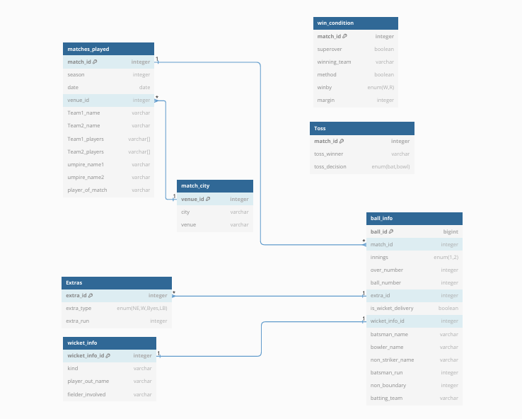

# ipl_mania

## Installation

```code
cd frontend
npm i
npm run dev
```

```code
cd backend
npm i
tsc -w
npm run dev
```

> Make a `.env` file in the backend directory, and copy the contents of `.example.env` in it.

## Database Design

### Schema Design



### Table Structure

**_public.ipl\_ball\_by\_ball_**

```sql
  CREATE TABLE ipl_ball_by_ball(
    id integer,
    innings integer,
    overs integer,
    ball_number integer,
    batter varchar,
    bowler varchar,
    nonstriker varchar,
    extra_type varchar,
    batsman_run integer,
    extras_run integer,
    total_runs integer,
    non_boundary integer,
    is_wicket_delivery integer,
    player_out varchar,
    kind varchar,
    fielders_involved varchar,
    batting_team varchar
  );
```

**_public.ipl\_match_**

```sql
  CREATE TABLE public.ipl_match(
    id int primary key,
    city varchar,
    match_date date,
    season int,
    match_number varchar,
    team1 varchar,
    team2 varchar,
    venue varchar,
    toss_winner varchar,
    toss_decision varchar,
    super_over varchar,
    winning_team varchar,
    won_by varchar,
    margin varchar,
    win_method varchar,
    player_of_match varchar,
    team1_players varchar[],
    team2_players varchar[],
    umpire1 varchar,
    umpire2 varchar
  );
```

**_public.match\_city_**

```sql
  CREATE TABLE public.match_city(
    venue_id serial primary key,
    city varchar,
    venue varchar
  );
```

**_public.win\_condition_**

```sql
  CREATE TABLE public.win_condition(
    match_id integer primary key,
    super_over boolean,
    winning_team varchar,
    win_method varchar,
    won_by varchar,
    margin varchar
  );
```

**_public.toss_**

```sql
  CREATE TABLE public.toss(
    match_id integer primary key,
    toss_winner varchar,
    toss_decision varchar
  );
```

**_public.matches\_played_**

```sql
  CREATE TABLE public.matches_played(
    match_id integer primary key,
    season int,
    match_date date,
    venue_id integer,
    team1 varchar,
    team2 varchar,
    team1_players varchar[],
    team2_players varchar[],
    umpire1 varchar,
    umpire2 varchar,
    player_of_match varchar,
    foreign key(venue_id) references match_city(venue_id)
  );
```

**_public.ball\_info_**

```sql
  CREATE TABLE  public.ball_info(
    ball_id serial primary key,
    match_id integer,
    innings integer,
    overs integer,
    ball_number integer,
    extra_id integer,
    is_wicket_delivery integer,
    wicket_info_id integer,
    batter varchar,
    bowler varchar,
    nonstriker varchar,
    batsman_run integer,
    non_boundary integer,
    batting_team varchar,
    foreign key(extra_id) references extras(extra_id),
    foreign key(wicket_info_id) references wicket_info(wicket_info_id)
  );
```

**_public.extras_**

```sql
  CREATE TABLE public.extras(
    extra_id serial primary key,
    extra_type varchar,
    extra_run integer
  );
```

**_public.wickets\_info_**

```sql
  CREATE TABLE public.wickets_info(
    wicket_info_id serial primary key,
    kind varchar,
    player_out varchar,
    fielder_involved varchar
  );
```
